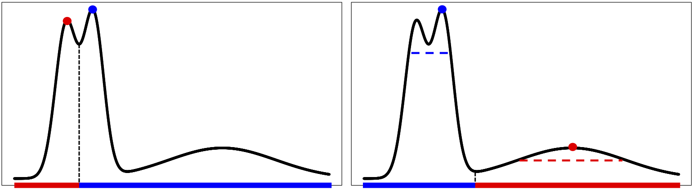
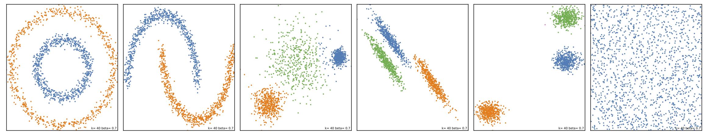

# DCFcluster

DCFcluster is a Python library for implementing the Density Core Finding (DCF) clustering method.



## Set Up

DCFcluster requires the NumPy, SciPy, SciKit Learn and Itertools libraries to operate. To run the example included, MatPlotLib is also required. 

## Run

To run CPFcluster on the synthetic datasets used as benchmarks in SciKit Learn:

```bash
python3 run_synthetic.py 
```
This will save a PDF in the directory demonstrating the ability of DCF to correctly cluster data. 

To call DCF for a dataset use
```python
from DCFcluster import DCFcluster
result = DCFcluster.train(X, k, beta)
```
The returned object contains the computed values for the peak-finding criterion (peak_values), the indices of points belonging to the cluster cores (core_sets) and the final clustering of the data (labels). 




## License
[MIT](https://choosealicense.com/licenses/mit/)

## Contributing
Pull requests are welcome. For major changes, please open an issue first to discuss what you would like to change.

Please make sure to update tests as appropriate.

## Questions or Comments
Please contact Joshua Tobin ([tobinjo@tcd.ie](mailto:tobinjo@tcd.ie)). 

Future additions to the repository will provide ways to pass arguments to DCF from the command line. 
